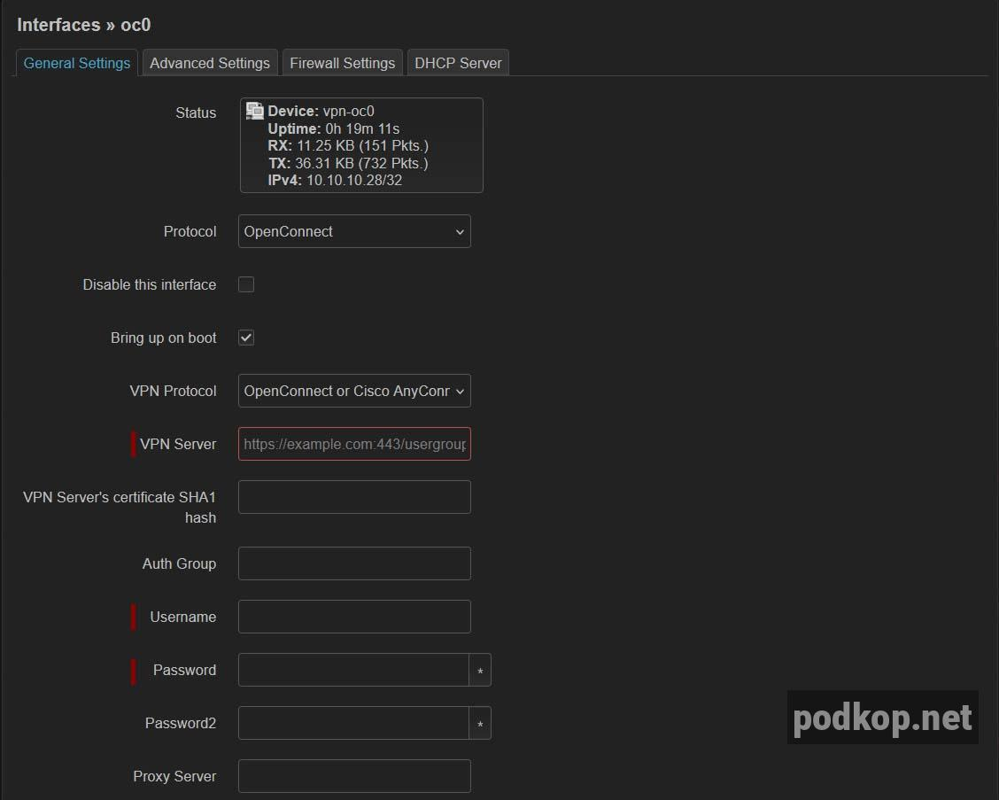

Туннель можно настроить через консоль и через LuCi(веб-интерфейс).

Предполагается что у вас есть имя пользователя, пароль и адрес сервера.

## Установка пакетов

Через терминал: 
```
opkg update && opkg install openconnect luci-proto-openconnect
```

Для установки через LuCi надо зайти в **System - Software** и в поле **Download and install package** ввести имена пакетов нажать **OK** и подтвердить установку.

## О правилах фаервола

Для работы с Podkop нам не требуется создавать зону фаервола и настраивать перенаправление с lan. 
Если вам нужно использовать на роутере OpenConnect не только для Podkop то обратитесь к [документации](https://openwrt.org/docs/guide-user/services/vpn/openconnect/client) OpenWRT или к [этому](https://itdog.info/nastrojka-klienta-openconnect-na-openwrt) руководству.

## Пример пользовательских настроек

Нам потребуются следующие настройки:

```
uri: 'test.com:8433'
# или с указанием ссылки, если вы используете камуфляж:
uri: 'test.com:8433/?NUqVl3YLuX'

username:'test'
password: 'hGTWLIzox9RNHDL'

```

Если сервер работает на стандартном порту, т.е 443 для https, вы можете его не указывать.

## Настройка через файл конфигурации

Открываем файл `/etc/config/network`, добавляем следующие строки:
```
config interface 'oc0'
	option proto 'openconnect'
	option uri '$uri'
	option username '$username'
	option password '$password'
	option vpn_protocol 'anyconnect'
	option defaultroute '0'

```

В переменные, начинающиеся с $ нужно подставить ваши значения

После этого необходимо перезагрузить сеть `service network restart`.

После перезагрузки должен появиться интерфейс oc0:
```
root@OpenWrt:~# ip a | grep oc0
21: vpn-oc0: <POINTOPOINT,MULTICAST,NOARP,UP,LOWER_UP> mtu 1500 qdisc fq_codel state UNKNOWN group default qlen 500
    inet 10.10.10.28/32 brd 255.255.255.255 scope global vpn-oc0
```

## Настройка через UCI

В переменные начинающиеся с $ нужно подставить ваши значения
```
uci set network.oc0=interface
uci set network.oc0.proto='openconnect'
uci set network.oc0.uri='$uri'
uci set network.oc0.username='$username'
uci set network.oc0.password='$password'
uci set network.oc0.vpn_protocol='anyconnect'
uci set network.oc0.defaultroute='0'
```

Затем применить изменения и перезагрузить сеть.
```
uci commit network
service network restart
```

## Настройка через LuCi

> [!NOTE]
> В данный момент наблюдается баг в приложении LuCi для OpenWRT, а именно поля `User certificate(PEM encoded)`, `User key(PEM encoded)`, `CA certificate` имеют не верный тип и отображают сообщение об ошибке `File not found`. Удалите эти строки из указанных полей, перед сохранением настроек.

Добавляем необходимый интерфейс. Для этого заходим в раздел **Network - Interfaces** и нажимаем **Add new interface**. В качестве `Protocol` выбираем **OpenConnect**, `Name` - Имя интерфейса, в качестве примера используем **oc0**. После этого перед вами откроется страница конфигурации интерфейса. 



В открывшемся окне нам нужно внести следующие параметры:

- VPN Server
- Username
- Password

После этого нажимаем **Save,  Save & Apply**.

У интерфейса должны появиться числа в полях RX и TX. 


## Проверка работы интерфейса

Проверить, что туннель работает, можно простым пингом с указанием интерфейса

```
ping -I vpn-oc0 itdog.info
```

Если интерфейс не поднялся, мы можем посмотреть логи так:

```
logread -f -e openconnect
```


## MTU

На данный момент наблюдается баг с установкой MTU со значением 1500 по-умолчанию,что может приводить к проблемам. Изменение  `option mtu` в `/etc/config/network` или `Override MTU` в **Advanced Settings**, в LuCi, не работает.

Чтобы исправить вручную, до первой перезагрузки интерфейса или роутера можно выполнить следующее:
```
ip link set dev vpn-oc0 mtu 1412
```
