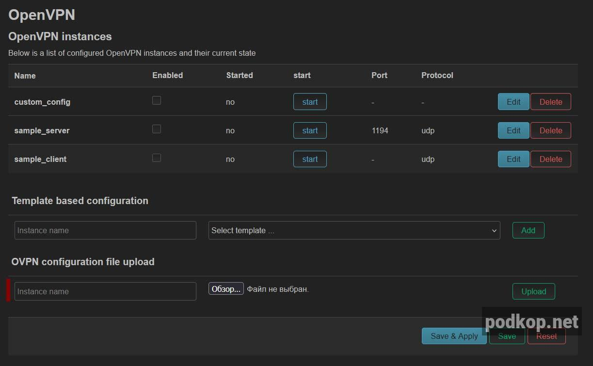

Туннель можно настроить через консоль и через LuCi (веб-интерфейс).

Предполагается что у вас есть работающий клиентский конфиг. 

## Установка пакетов

Через терминал: 
```
opkg update && opkg install openvpn-openssl luci-app-openvpn
```

Для установки через LuCi надо зайти в **System - Software** и в поле **Download and install package** ввести имена пакетов нажать **OK** и подтвердить установку.

## О правилах фаервола

Для работы с Podkop нам не требуется создавать зону фаервола и настраивать перенаправление с lan. 
Если вам нужно использовать на роутере OpenVPN не только для Podkop то обратитесь к [статье](https://itdog.info/nastrojka-klienta-openconnect-na-openwrt/)

## Пример пользовательского файла конфигурации

Клиентский файл конфигурации обычно содержит раздел настроек подключения, сертификаты и ключи, так же может содержать дополнительные настройки, например, **tls-auth**. Для краткости пример сокращен и содержит только разделы.
```
client
dev tun
proto udp
resolv-retry infinite
nobind
persist-key
persist-tun

cipher AES-256-GCM
auth SHA512
verb 3
tls-client
tls-version-min 1.2
key-direction 1
remote-cert-tls server


dhcp-option DNS 1.1.1.1
dhcp-option DNS 1.0.0.1


remote 51.83.138.160 36784

<ca>
...
</ca>

<cert>
...
</cert>

<key>
...
</key>

<tls-auth>
...
</tls-auth>
```

Если вы отключали поддержку ipv6 на роутере и в логах видите следующую ошибку:
```
Mon Jun  2 16:40:47 2025 daemon.notice openvpn(client)[28313]: net_addr_v6_add: fd15:53b6:dead::2/64 dev tun0
Mon Jun  2 16:40:47 2025 daemon.warn openvpn(client)[28313]: sitnl_send: rtnl: generic error (-13): Permission denied
Mon Jun  2 16:40:47 2025 daemon.err openvpn(client)[28313]: Linux can't add IPv6 to interface tun0
Mon Jun  2 16:40:47 2025 daemon.notice openvpn(client)[28313]: Exiting due to fatal error
```

Удалите из конфига строку вида:
`ifconfig-ipv6 fd15:53b6:dead::2/64  fd15:53b6:dead::1`

## Настройка через LuCi

Заходим в LuCi и переходим в раздел **VPN-OpenVPN**.



В разделе **OVPN configuration file upload** в поле `Instance name` вводим произвольное имя, нажимаем **Choose file**, выбираем конфиг в формате .ovpn, после чего нажимаем **Upload**.

Этот конфиг появится в разделе **OpenPN instances**. Включите его, отметив галочкой в столбце **Enabled**, и нажмите **Save & Apply**

В столбце **Started** должен появиться статус **yes**. С помощью нажатия на кнопку **start/stop** мы можем останавливать и запускать туннель. Если вам нужно отредактировать конфиг намите кнопку **Edit** рядом с вашими настройками, внесите необходимые изменения и нажмите **Save**.


## Настройка через консоль (копированием файла конфигурации на роутер):

У OpenVPN есть специальная директория `/etc/openvpn/` в которую мы можем поместить конфиг. OpenVPN обнаружит его при запуске и поднимет туннель.

>[!NOTE]
>Обратите внимание что нам нужно, чтобы конфиг имел расширение .conf, иначе OpenVPN его не увидит. Если у вас он в формате .ovpn не забудьте это учесть при отправке конфига на роутер. 

Отправляем наш конфиг на роутер удобным вам способом.
К примеру, используя scp, команда будет выглядеть так:
```
scp client.ovpn root@192.168.1.1:/etc/openvpn/client.conf
```

После чего запускаем OpenVPN:
```
service openvpn start
```

Проверяем что интерфейс поднялся. По-умолчанию это будет tun0:
```
root@OpenWrt:~# ip a | grep tun0
89: tun0: <POINTOPOINT,MULTICAST,NOARP,UP,LOWER_UP> mtu 1500 qdisc fq_codel state UNKNOWN group default qlen 500
    inet 10.8.0.6 peer 10.8.0.5/32 scope global tun0
```

Проверить что туннель работает можно простым пингом с указанием интерфейса
```
ping -I tun0 itdog.info
```

## Перенаправление всего трафика в туннель

За перенаправление всего трафика в OpenVPN отвечает директива `redirect-gateway`. Она может находиться в вашем клиентском конфиге, либо сам OpenVPN сервер может проставлять соединению без вашего спроса.

Проверить, идёт ли весь трафик в туннель на роутере, можно через команду `traceroute` к любому незаблокированному ресурсу

```
root@OpenWrt:~# traceroute itdog.info
traceroute to itdog.info (95.217.5.75), 30 hops max, 46 byte packets
 1  10.12.0.1 (10.4.0.1)  67.590 ms  66.855 ms  67.474 ms
 2  172.31.1.1 (172.31.1.1)  71.196 ms  70.921 ms  70.797 ms
 ```

Если на первом месте не IP роутера, а незнакомый IP (или знакомый, если vpn сервер ваш), то трафик идёт через туннель.

Также можно посмотреть таблицу маршрутизации:

```
root@OpenWrt:~# ip r
0.0.0.0/1 via 10.8.0.1 dev tun0 
```

`0.0.0.0/1`  означает, что весь трафик идёт в интерфейс `tun0`.

В случае если перенаправления всего трафика нет, строка будет выглядеть так:
```
10.8.0.1 via 10.8.0.5 dev tun0
```

Если вам не нужно перенаправлять весь трафик в туннель, а это происходит, проверьте ваш конфиг.
Если в нем присутствует директива `redirect-gateway`, то нужно её удалить.

Если в клиентском конфиге она отсутствует, но маршрут всё равно прописывается и весь трафик идёт в туннель, то в конфиге клиента добавляем строку
```
pull-filter ignore redirect-gateway
```

Это может выглядеть так

```
verb 3
pull-filter ignore redirect-gateway
<ca>
-----BEGIN CERTIFICATE-----
```

Она будет игнорировать настройку сервера.

Делаем рестарт OpenVPN, либо из LuCi, открыв **System-Startup** и отыскав там OpenVPN, либо из командной строки
```
service openvpn restart
```

